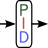

# LazScience

**LazScience** is a package of Lazarus/Free Pascal (LCL) components for building scientific and engineering-instrument applications: unit-aware numeric input, a full-featured PID controller with autotuning, delimited-text data file loading with an interactive format picker, thermocouple voltage–temperature conversion, GATAN DigitalMicrograph file parsing, and cross-platform form-state persistence.

All components install into a **Science** tab on the component palette and are designed to be dropped on a form, tuned from the Object Inspector, and driven from a few lines of code.

---

## Components

| Logo | Component | Unit | Description |
|---|---|---|---|
|  | **`TSciEdit`** | `uSciEdit.pas` | A unit-aware numeric edit control. Type a number and a unit in one string (`"2.5 MPa"`, `"20 °C"`, `"10 kg*m/s^2"`) and it parses, validates, converts between units, and auto-formats the result — with SI-prefix handling, 26 built-in physical-quantity families, custom units, and optional `TTrackBar` binding for slider-style scrubbing. See **[TSCIEDIT.md](TSCIEDIT.md)**. |
|  | **`TSciPID`** | `uSciPID.pas` | A thread-safe PID controller: proportional/integral/derivative/feed-forward control, selectable anti-windup and derivative-filtering strategies, output rate limiting, setpoint ramping, and a per-cycle safety-status report. Includes a relay-feedback (Åström–Hägglund) **autotuner** that measures the plant and computes tuning gains automatically, transparently layered on the same update loop. See **[TSCIPID.md](TSCIPID.md)**. |
|  | **`TSciReader`** | `uSciReader.pas` | A non-visual component that parses delimited text data files (instrument logs, CSV/TSV exports, etc.) into rows/columns of cells and numeric values, with configurable delimiter, comment, quoting, header-skipping, decimal-style, and an embedded file-timestamp extractor. See **[TSCIREADER.md](TSCIREADER.md)**. |
|  | **`TSciReaderDlg`** | `uSciReaderDlg.pas` | An interactive file-format dialog: lets the user pick a file, choose its delimiter/comment/decimal/date-time characters while watching a live parse preview, and loads the result straight into a linked `TSciReader`. Documented together with `TSciReader`, since the two are normally used as a pair. See **[TSCIREADER.md](TSCIREADER.md)**. |
|  | **`TSciThermocouple`** | `uSciThermoCouple.pas` | Converts between thermocouple EMF (in volts) and temperature for nine standard IEC/NIST thermocouple types (B, C, E, J, K, N, R, S, T). Supports four temperature scales (Celsius, Kelvin, Fahrenheit, Rankine) and full cold-junction compensation. See **[TSCITHERMOCOUPLE.md](TSCITHERMOCOUPLE.md)**. |
|  | **`TSciDM3`** | `uSciDM3.pas` | Parses GATAN DigitalMicrograph 3 (`.dm3`) files and exposes the image data (as a 3-D variant array), the full metadata tag tree, calibration records (pixel size, units, origin), the embedded thumbnail, display limits, and rendered bitmaps. See **[TSCIDM3.md](TSCIDM3.md)**. |
|  | **`TSciDM3Connector`** | `uSciDM3Connector.pas` | A companion component to `TSciDM3` that wires the parser's output to a `TTreeView` (for the metadata tag hierarchy) and/or a `TImage` (for the rendered data image), with selectable colour scheme and slice selection for 3-D datasets. Documented together with `TSciDM3`. See **[TSCIDM3.md](TSCIDM3.md)**. |
|  | **`TSciRestorer`** | `uSciRestorer.pas` | Saves and restores form size, position, window state, and docked panel layout across application sessions using an INI file. Fully cross-platform; supports per-user, per-application, and custom INI locations. Drop one instance on a form for zero-code persistence, or call `SaveForm`/`RestoreForm` to manage multiple forms from a single instance. See **[TSCIRESTORER.md](TSCIRESTORER.md)**. |

---

## Installation

LazScience is distributed as a Lazarus package (`LazScience.lpk`), which declares all components and their supporting units in one place, so there is no need to add units to your project individually.

1. In Lazarus, open **Package → Open Package File (.lpk)** and select `LazScience.lpk`.
2. In the Package Editor, click **Use → Install**. Lazarus will rebuild and restart the IDE with the package installed.
3. All components will appear on the **Science** tab of the component palette, ready to drop onto any form.

The package depends only on `LCLBase` and `FCL`, both part of a standard Lazarus install, so no other packages need to be installed first.

To use LazScience in a project without installing it into the IDE (e.g. for a headless build), add `LazScience.lpk` to the project's **Required Packages** instead — Lazarus will pick up the units automatically at compile time without registering the components on the palette.

---

## Documentation

- **[TSCIEDIT.md](TSCIEDIT.md)** — `TSciEdit`: unit families, custom units, design-time and code usage.
- **[TSCIPID.md](TSCIPID.md)** — `TSciPID`: the PID algorithm, every configuration parameter, autotuning, and design-time/code usage.
- **[TSCIREADER.md](TSCIREADER.md)** — `TSciReader` and `TSciReaderDlg`: file format options, the interactive format dialog, and using the two together or `TSciReader` alone.
- **[TSCITHERMOCOUPLE.md](TSCITHERMOCOUPLE.md)** — `TSciThermocouple`: supported types, temperature scales, cold-junction compensation, and accuracy notes.
- **[TSCIDM3.md](TSCIDM3.md)** — `TSciDM3` and `TSciDM3Connector`: loading and parsing DM3 files, accessing image data and metadata, and wiring the connector to UI controls.
- **[TSCIRESTORER.md](TSCIRESTORER.md)** — `TSciRestorer`: INI file locations, what is saved, DPI scaling, panel handling, and multi-form usage.

---

## License

This package is released under the **GNU Lesser General Public License v2.1 or later (LGPL-2.1-or-later)**.

You are free to use, study, modify, and redistribute it under the terms of the LGPL. If you distribute a modified version of this package or any of its components, you must do so under the same license.

See [https://www.gnu.org/licenses/lgpl-2.1.html](https://www.gnu.org/licenses/lgpl-2.1.html) for the full license text.

> **Note for application developers:** `LazScience` is licensed under the LGPL with the same linking exception used by `Free Pascal` and `Lazarus`. This allows the components in this package to be linked into commercial and closed-source applications without disclosing your application's source code. Only modifications made directly to the `LazScience` package or its components must remain open source under the LGPL.

---

## Disclaimer

> I am not a professional programmer. These components are a hobby project, written for my own use and shared in the hope that others may find them useful. They have been developed and tested to the best of my ability, but they come with **no warranty of any kind**. Use them at your own risk. Bug reports and suggestions are welcome, but I cannot guarantee timely responses or fixes.
